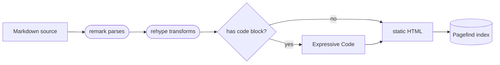
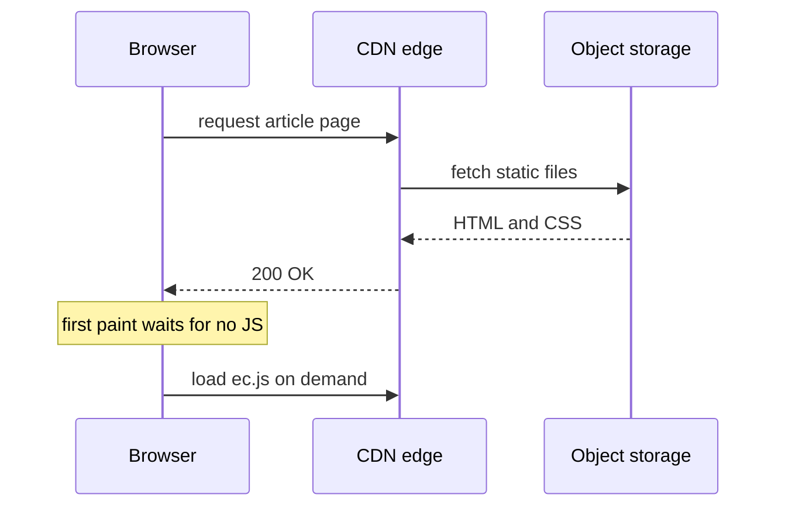

This is a **sample post**. It is not meant to be read start to finish — it is meant to be **checked section by section**: every piece of markup below should have a matching rendering result. If something looks off, the pipeline is broken.

A bit of everything inline: *italic*, **bold**, ~~struck through~~, `inline code`, an [internal post](/en/blog/zero-js-first/), and a footnote[^note].

## 1. Text and typography

### Lists and nesting

- Top-level item
  - Nested one level
    - Nested two levels
- Second top-level item

1. Step one: parse the Markdown
2. Step two: transform to hast
3. Step three: emit static HTML

Task list:

- [x] Syntax highlighting
- [x] Window frames and file names
- [x] Line numbers
- [ ] Collapsible sections (plugin not enabled)

### Blockquotes

> First line of the quote.
> Second line, no blank line in between, so it should merge into one paragraph.

### Tables

| Element | Syntax | Notes |
| --- | --- | --- |
| Inline code | backticks | Uses the site token colors |
| Strikethrough | double tilde | Comes from GFM |
| Tables | pipes | Wide tables scroll horizontally |
| Diagrams | mermaid fence | Rendered in the browser |
| Footnotes | bracket + caret | Collected at the end |

## 2. Code blocks

### File name and line numbers

```ts title="src/lib/lru.ts" showLineNumbers
type Node<K, V> = { key: K; value: V; prev?: Node<K, V>; next?: Node<K, V> };

export class LRUCache<K, V> {
  private map = new Map<K, Node<K, V>>();
  private head?: Node<K, V>;
  private tail?: Node<K, V>;

  constructor(private readonly capacity: number) {
    if (capacity <= 0) throw new RangeError("capacity must be positive");
  }

  get(key: K): V | undefined {
    const node = this.map.get(key);
    if (!node) return undefined;
    this.moveToFront(node);
    return node.value;
  }

  set(key: K, value: V): void {
    const existing = this.map.get(key);
    if (existing) {
      existing.value = value;
      this.moveToFront(existing);
      return;
    }
    if (this.map.size === this.capacity) this.evict();
    const node: Node<K, V> = { key, value };
    this.map.set(key, node);
    this.moveToFront(node);
  }

  private moveToFront(node: Node<K, V>): void {
    this.unlink(node);
    node.next = this.head;
    node.prev = undefined;
    if (this.head) this.head.prev = node;
    this.head = node;
    this.tail ??= node;
  }

  private unlink(node: Node<K, V>): void {
    if (node.prev) node.prev.next = node.next;
    if (node.next) node.next.prev = node.prev;
    if (this.head === node) this.head = node.next;
    if (this.tail === node) this.tail = node.prev;
  }

  private evict(): void {
    if (!this.tail) return;
    this.map.delete(this.tail.key);
    this.unlink(this.tail);
  }
}
```

### Line highlighting

Put line numbers in curly braces — commas for singles, hyphens for ranges. Note that line numbers are **relative to the block itself**, not to the original source file:

```ts {2-4}
  get(key: K): V | undefined {
    const node = this.map.get(key);
    if (!node) return undefined;
    this.moveToFront(node);
    return node.value;
  }
```

### Text markers

Wrap the fragment you want to highlight in slashes:

```ts /capacity/
  constructor(private readonly capacity: number) {
    if (capacity <= 0) throw new RangeError("capacity must be positive");
  }
```

### Diff

```diff
   get(key: K): V | undefined {
     const node = this.map.get(key);
     if (!node) return undefined;
     this.moveToFront(node);
+    this.hits += 1;
     return node.value;
   }
```

### Very long lines

Lines wider than the column wrap, and keep their original indentation:

```ts
const endpoint = "https://api.example.com/v1/tenants/8f14e45fceea167a5a36dedd4bea2543/reports/daily-occupancy?from=2026-01-01&to=2026-08-30&dimensions=tenant,store,channel&metrics=adr,revpar,occupancy";
```

### Terminal

```bash
npm install
npm run build
npm run preview
```

### Plain text

```plain
┌──────────┐    ┌──────────┐    ┌──────────┐
│ Markdown │───►│  remark  │───►│  rehype  │
└──────────┘    └──────────┘    └──────────┘
                                      │
                                      ▼
                            ┌───────────────────┐
                            │  Expressive Code  │
                            └───────────────────┘
```

## 3. Diagrams

### Flowchart



### Sequence diagram



## 4. Odds and ends

A horizontal rule, to check the `hr` style inside the article body:

---

Bare URLs become links on their own: https://expressive-code.com/

Footnote text is collected at the end of the post[^note].

[^note]: This is the footnote. It proves the GFM footnote extension is enabled and rendered below the body copy.
