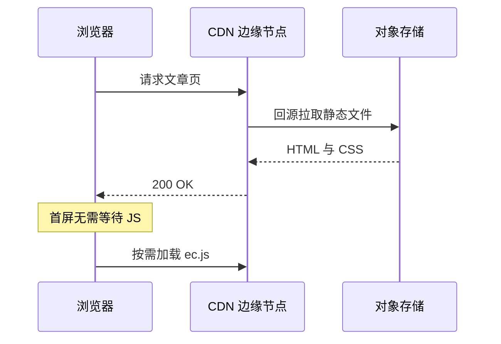

这是一篇**样张**。它存在的意义不是被读完，而是被**逐段对照**：每一段标记语法下面，都应该出现对应的渲染结果。如果某处看起来不对，那就是渲染管线出了问题。

行内元素先各来一份：*斜体*、**粗体**、~~已删除~~、`inline code`、[站内文章](/blog/zero-js-first/)，以及一个脚注[^note]。

## 一、文本与排版

### 列表与嵌套

- 一等条目
  - 嵌套一层
    - 嵌套两层
- 二等条目

1. 第一步：解析 Markdown
2. 第二步：转换 hast
3. 第三步：输出静态 HTML

任务清单：

- [x] 语法高亮
- [x] 窗口框架与文件名
- [x] 行号
- [ ] 折叠区块（尚未启用插件）

### 引用

> 引用块第一行。
> 引用块第二行，中间没有空行，应当合并成一段。

### 表格

| 元素 | 写法 | 说明 |
| --- | --- | --- |
| 行内代码 | 反引号 | 使用站点 token 配色 |
| 删除线 | 双波浪号 | 来自 GFM 扩展 |
| 表格 | 管道符 | 宽表可横向滚动 |
| 图表 | mermaid 代码块 | 浏览器端渲染 |
| 脚注 | 方括号加插入符 | 文末统一汇总 |

## 二、代码块

### 文件名与行号

```ts title="src/lib/lru.ts" showLineNumbers
type Node<K, V> = { key: K; value: V; prev?: Node<K, V>; next?: Node<K, V> };

export class LRUCache<K, V> {
  private map = new Map<K, Node<K, V>>();
  private head?: Node<K, V>;
  private tail?: Node<K, V>;

  constructor(private readonly capacity: number) {
    if (capacity <= 0) throw new RangeError("capacity must be positive");
  }

  get(key: K): V | undefined {
    const node = this.map.get(key);
    if (!node) return undefined;
    this.moveToFront(node);
    return node.value;
  }

  set(key: K, value: V): void {
    const existing = this.map.get(key);
    if (existing) {
      existing.value = value;
      this.moveToFront(existing);
      return;
    }
    if (this.map.size === this.capacity) this.evict();
    const node: Node<K, V> = { key, value };
    this.map.set(key, node);
    this.moveToFront(node);
  }

  private moveToFront(node: Node<K, V>): void {
    this.unlink(node);
    node.next = this.head;
    node.prev = undefined;
    if (this.head) this.head.prev = node;
    this.head = node;
    this.tail ??= node;
  }

  private unlink(node: Node<K, V>): void {
    if (node.prev) node.prev.next = node.next;
    if (node.next) node.next.prev = node.prev;
    if (this.head === node) this.head = node.next;
    if (this.tail === node) this.tail = node.prev;
  }

  private evict(): void {
    if (!this.tail) return;
    this.map.delete(this.tail.key);
    this.unlink(this.tail);
  }
}
```

### 行高亮

花括号里写行号，用逗号分隔、连字符表示区间。注意行号是**相对当前代码块**的，不是源文件里的绝对行号：

```ts {2-4}
  get(key: K): V | undefined {
    const node = this.map.get(key);
    if (!node) return undefined;
    this.moveToFront(node);
    return node.value;
  }
```

### 文本标记

用斜杠包住要标记的片段：

```ts /capacity/
  constructor(private readonly capacity: number) {
    if (capacity <= 0) throw new RangeError("capacity must be positive");
  }
```

### 差异对比

```diff
   get(key: K): V | undefined {
     const node = this.map.get(key);
     if (!node) return undefined;
     this.moveToFront(node);
+    this.hits += 1;
     return node.value;
   }
```

### 超长行

超过一屏的长行会自动折行，并且保留原始缩进：

```ts
const endpoint = "https://api.example.com/v1/tenants/8f14e45fceea167a5a36dedd4bea2543/reports/daily-occupancy?from=2026-01-01&to=2026-08-30&dimensions=tenant,store,channel&metrics=adr,revpar,occupancy";
```

### 终端

```bash
npm install
npm run build
npm run preview
```

### 纯文本

```plain
┌──────────┐    ┌──────────┐    ┌──────────┐
│ Markdown │───►│  remark  │───►│  rehype  │
└──────────┘    └──────────┘    └──────────┘
                                      │
                                      ▼
                            ┌───────────────────┐
                            │  Expressive Code  │
                            └───────────────────┘
```

## 三、图表

### 流程图


### 时序图



## 四、零散元素

一条分隔线，用来检验文章内部的 `hr` 样式：

---

自动链接直接写就行：https://expressive-code.com/

脚注的内容会汇总到文章末尾[^note]。

[^note]: 这就是脚注。它证明了 GFM 的脚注扩展已经启用，并且渲染在正文下方。
